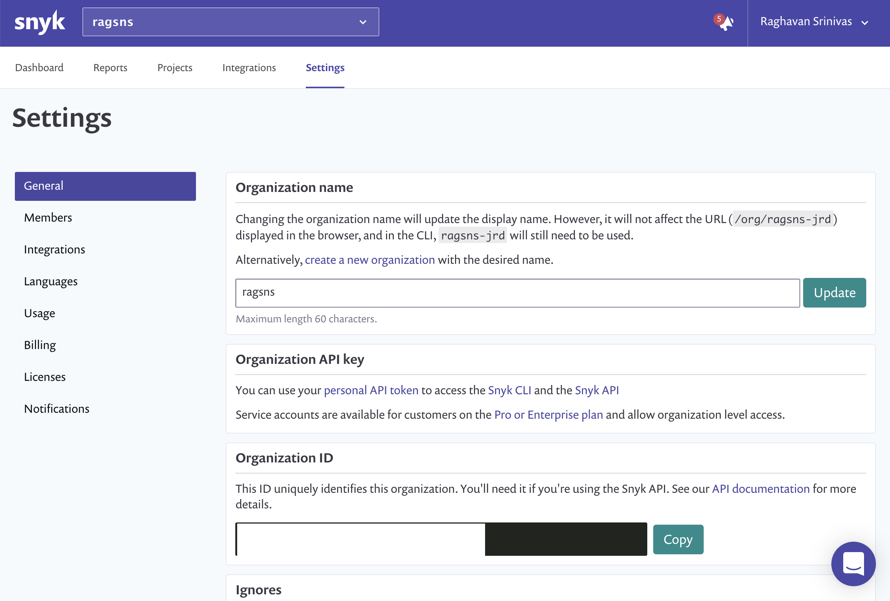
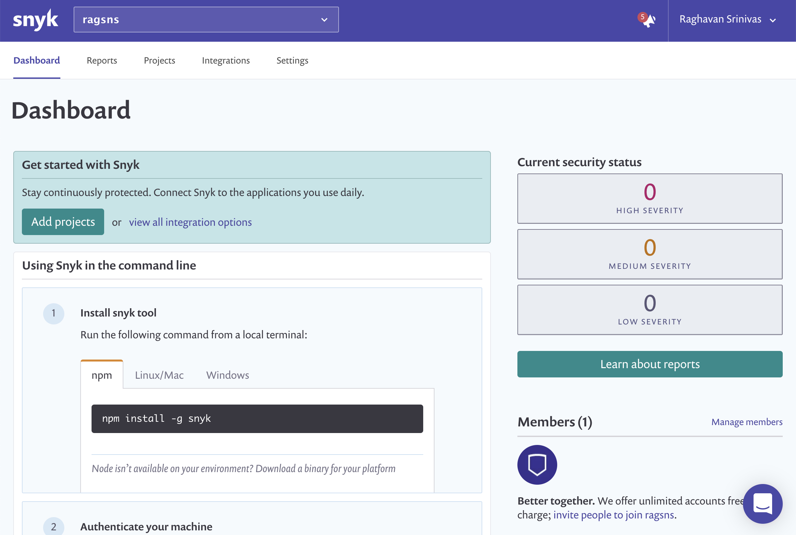
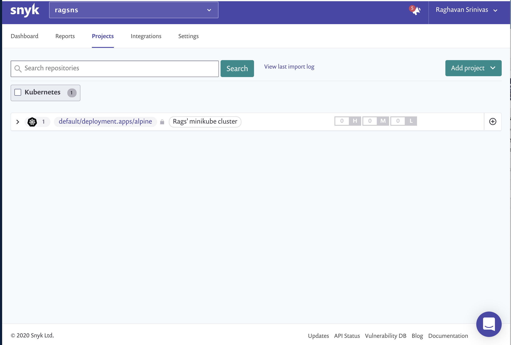
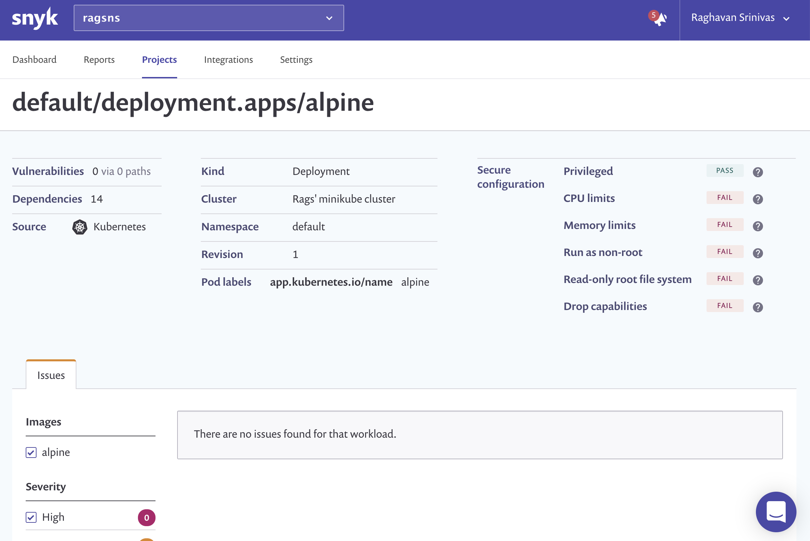

# Pushing Kubernetes workload information to Snyk dashboards via annotations

## Introduction

The [Kubernetes Integration Overview](https://support.snyk.io/hc/en-us/articles/360003916138-Kubernetes-integration-overview) link describes how the `snyk-monitor` can be injected into a Kubernetes cluster and how workloads can be monitored via the Snyk dashboard.

In this blog, we will outline how the information can be pushed to the dashboard either manually or as part of a devops pipeline.

As long as ```snyk-monitor```, also referred to as the snyk controller has been already installed on the cluster, information on specific workloads can be **pushed** to the snyk dashboard via appropriate Kubernetes annotations as outlined below.

## Ensure that the Snyk Controller is installed on the cluster

If you have not already done this follow the steps outlined in [Snyk Controller installation](https://support.snyk.io/hc/en-us/articles/360003916158-Snyk-controller-installation-for-Kubernetes-integration).

You can verify that the Snyk controller has been installed by running the following command.

```
kubectl get pods --namespace snyk-monitor
```

You should see a running pod as below.

```
NAME                            READY   STATUS    RESTARTS   AGE
snyk-monitor-7445d5849c-n2vzw   1/1     Running   0          102m
```

## Let's get the Organization ID

For the organization, get the organization ID from the Settings tab of the Snyk dashboard as shown below.




It's going to be a format similar to aaaaaaaa-bbbb-cccc-dddd-eeeeeeeeeeee comprising of hexadecimal digits.

Notice that the dashboard has no reports or projects added as below.



## Installing a workload

Let's install a new workload on the cluster. You can follow essentially the same process for an existing workload as well.

Let's create an `YAML` file, called `alpine-noann.yaml` with the following contents to install a simple workload.

```
apiVersion: apps/v1
kind: Deployment
metadata:
  name: alpine
  namespace: default
  labels:
    app.kubernetes.io/name: alpine
  spec:
  selector:
    matchLabels:
      app.kubernetes.io/name: alpine
  template:
    metadata:
      labels:
        app.kubernetes.io/name: alpine
    spec:
      containers:
      - name: alpine
        image: alpine:3.9
        command: ['sh', '-c', 'echo Hello from alpine pod! && sleep 360000']
        resources:
          requests:
            cpu: '100m'
            memory: '100Mi'
            cpu: '100m'
      securityContext: {}
```

Running the following command

```
kubectl create -f alpine-noann.yaml
```

Will create an alpine container. If you refresh the Snyk dashboard nothing happens -- Not entirely surprising. So let's go ahead and delete the pod with the following command.

```
kubectl delete -f alpine-noann.yaml
```

Now, let's see how we can push the workload information by adding annotations.

## Adding the annotation to the workload

We create another file `alpine.yaml` with slightly modified contents. It includes an annotation `orgs.k8s.snyk.io/v1` that when set to the organization ID we obtained in the earlier step, will **push** the workload information to the Snyk dashboard.

Create the file `alpine.yaml` with the following contents making sure to substitute the right organization ID for `orgs.k8s.snyk.io/v1` in the `annotations` section below.

```
apiVersion: apps/v1
kind: Deployment
metadata:
  name: alpine
  namespace: default
  labels:
    app.kubernetes.io/name: alpine
  annotations:
    orgs.k8s.snyk.io/v1: aaaaaaaa-bbbb-cccc-dddd-eeeeeeeeeeee
spec:
  selector:
    matchLabels:
      app.kubernetes.io/name: alpine
  template:
    metadata:
      labels:
        app.kubernetes.io/name: alpine
    spec:
      containers:
      - name: alpine
        image: alpine:3.9
        command: ['sh', '-c', 'echo Hello from alpine pod! && sleep 360000']
        resources:
          requests:
            cpu: '100m'
            memory: '100Mi'
            cpu: '100m'
      securityContext: {}
```

The difference between this `YAML` file and the one we created earlier is the added annotation in this file. Now create the workload with the following command

```
kubectl create -f alpine.yaml
```

## Monitor the workload from the dashboard

Refresh the browser and Voila, you should see the workload information as below.



If you dig down on the settings tab, you will notice the improper configuration parameters repored for the workload which can be fixed by modifying the `YAML` file.




## Summary

We saw how to push specific workload information to the centralized Snyk dashboard by adding an annotation to the workload that included the organization ID of where this information was going to be gathered and monitored.

That's all that there is to pushing workload information from the cluster for centralized monitoring.
